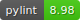
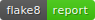
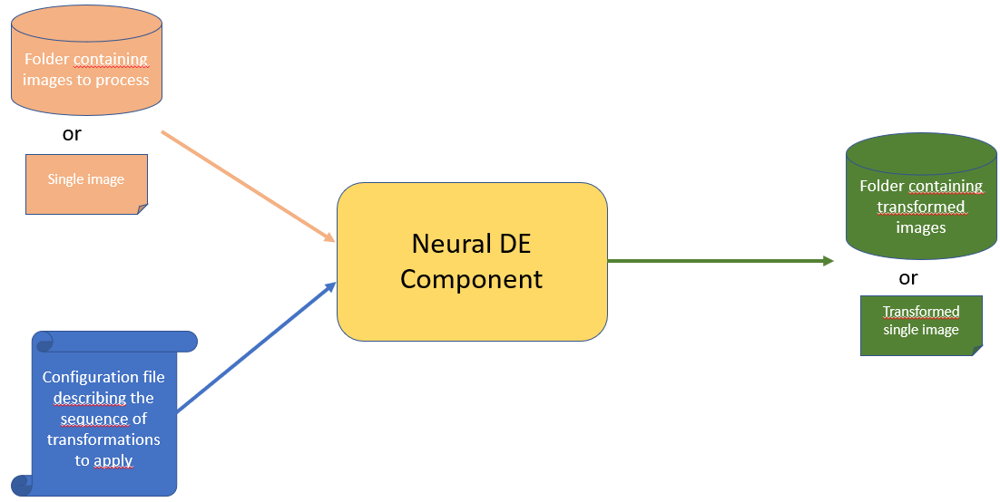

<div align="center">
    
    <h1 style="font-size: large; font-weight: bold;">neuralde</h1>
</div>

<div align="center">
    <a href="#">
        
    </a>
    <a href="#">
        
    </a>
    <a href="#">
        
	<a href="_static/pylint/pylint.txt">
        
    </a>
    <a href="_static/flake8/index.html">
        
    </a>


</div>

<br>

<div align="center">
    <a href="https://github.com/IRT-SystemX/neuralde">
        
    </a>
    <a href="https://irt-systemx.github.io/neuralde/">
        
    </a>
    <a href="https://pypi.org/project/neuralde/">
        
    </a>
    <a href="https://hub.docker.com/r/irtsystemx/neuralde">
     
  </a>
</div>

<br>
<br>

# Presentation

🔍 Identity card
-----------------

-  Version: 1.1.0
-  Python Version: 3.9, 3.10
-  Strong Dependencies: Tensorflow, pytorch
-  Trustworthy attributes : Robustness
-  Hardware : CPU / GPU
-  Engineering activities : Data Engineer, ML-Algorithm Engineer
-  Functional set : Robustness, Operation, Evaluation


## General presentation
Neuralde is a python library made to improve the robustness of your models at test time. It proposes a set of methods 
that will allow you to remove identified corruptions in your data before you send it to your model. 
This library addresses issues such as meteorological corruptions, distribution shifts etc.

All methods provided by the library are associated with examples based on open sourced images. 
You can refer to each jupyter notebook for specifics.
These notebooks are linked directly in the technical documentation.

This library can be used in two ways:
- Call it as a main executable to direct process a batch of input images. 
- Import the lib within your python code for an explicit call of included transformations functions 

## I/O description
The executable version of the component take as input :
- A single image or a folder containing all images to process
- A yaml configuration file describing the sequence of transformations you want to apply on your input images

As return as output

- The processed single image or a folder containing all processed images from your input folder

This can be summed-up by the schema below



The executable version can be run directly by installing the python library or by running the dockerized version.
We describe in the following the process in two cases.

# Getting started 

## Set up a clean virtual environnement
Tested python versions : [3.9.18, 3.10.16]

Linux setting:

```
pip install virtualenv
virtualenv myenv
source myenv/bin/activate
```

Windows setting:

```
pip install virtual env 
virtualenv myenv 
.\myenv\Scripts\activate
```

## Install the library (restricted access)

You can install it by a direct downloading from PyPi using the command 

````
pip install neuralde
````

You can install it from it github sources by launching the following command
````
pip install git+https://github.com/IRT-SystemX/neuralde
````
If you got the source code as a zip file, you can install the library from the root directory of the archive by typing : 
```
pip install .
```


## Use the executable

The neural_de executable has 4 parameters : 

- **input_source_path** : This a required arg representing the path to the input source to process. If path represent a single file path. The single file will be \
             processed. If the input source path represents a directory, all images present in directory will be processed. Warning : In that case, all images shall have the same resolution as
             some method requires this constraint and will raise an error if they don't.

- **output_target_path** : Output path where results are stored. If input path is a file, this path represents the output file, \
            else this is the path to oupput direcotry"

- **pipeline_file_path** : Yaml Pipeline Configuration file to use. 

- **output_prefix** : (optional) 0utput_prefix to add to output image filenames in target directory. By default,original names are kept.

For example, with this command:

```
neural_de --input_source_path test_image/test_snow.png  --output_target_path /pipeline_result/snow_processed.png --pipeline_file_path=user_conf_1.yaml 
```

The image ```test_snow.png``` in folder ``` test_image```  is processed through the transformation pipeline defined in ``` user_conf_1.yaml ``` and the results image is stored as a file named ```snow_processed.png```
in ```pipeline_results``` directory

With this command

``` 
neural_de --input_source_path test_images/snow_test  --output_target_path pipeline_res/snow/snow_pipeline_res --output_prefix "transformed_"    --pipeline_file_path=conf_test_1.yaml 
``` 

All images present in subfolder ``` test_images/snow_test```  are processed through the transformation pipeline defined in ``` user_conf_1.yaml ``` and all results images are stored in directory  ``` pipeline_res/snow/snow_pipeline_res``` 
with their name preceded of prefix "transformed_"

## Use the docker version

You can build manually the image from the source, by cloning the source repository from this url https://github.com/IRT-SystemX/neuralde.
Then,  from cloned repository source directory type in a terminal :

```
docker build . -f dockerfile -t irtsystemx/neuralde:1.1.0
```

Or you can direct download the docker image neuralde from dockerhub by typing : 

```
docker pull irtsystemx/neuralde:1.1.0
``` 

The docker pass the input args of neural_de executable through environnement variables.
The only difference is that corresponding source and target dir shall be mounted in the container sotrage to be acessible
forlder ```tmp/in``` and ```tmp/out``` and ```/tmp``` folder are used to store source_dir and target_dir and pipeline_config_file in container.

Thus, to process a directory as source input use the following command

```
docker run -e INPUT_SOURCE_PATH=your_dir -e OUTPUT_TARGET_PATH=your_target_dir -e PIPELINE_PATH=path_to_your_config_  -v your_=target_dir:/tmp/in/your_target_dir -v your_config_file:/tmp/your_config_file irtsystemx/neuralde:1.1.0
```

For example, if your images to process are in a subfolder named ```test_images/snow_test``` your config file is at path ```conf_test_1.yaml``` and you want that processed images
to be in output folder ```docker_res2/snow_test```, you will launch the following command :

```
docker run -e INPUT_SOURCE_PATH="test_images/snow_test" -e OUTPUT_TARGET_PATH="docker_res" -e PIPELINE_FILE_PATH="conf_test_1.yaml" -v  ${PWD}/conf_test_1.yaml:/tmp/conf_test_1.yaml -v ${PWD}/test_images/snow_test:/tmp/in/test_images/snow_test -v ${PWD}/docker_res_2/snow_test:/tmp/out/docker_res/ irtsystemx/neuralde:1.1.0
```
For example, if your images to process are in a subfolder named ```test_images/snow_test``` and your config file is at path ```conf_test_1.yaml``` and you want that processed images
to be in output folder ```docker_res2/snow_test```, you will launch the following command :

```
docker run -e INPUT_SOURCE_PATH="test_images/test_snow.webp" -e OUTPUT_TARGET_PATH="docker_res/res.png" -e PIPELINE_FILE_PATH="conf_test_1.yaml" -v  ${PWD}/conf_test_1.yaml:/tmp/conf_test_1.yaml -v ${PWD}/test_images/test_snow.webp:/tmp/in/test_images/test_snow.webp -v ${PWD}/docker_res_2/:/tmp/out/docker_res/ irtsystemx/neuralde:1.1.0
```

# Define your configuration pipeline

A pipeline configuraiton file is a yaml file containing the list of transformation method to call
and for each of them eventually the name of user parameters to overload:

Here is below an example of such yaml file:
```
- name: CenteredZoom
  init_param:
    keep_ratio: 0.4
- name: DeSnowEnhancer
  init_param:
    device: 'cpu'
- name: KernelDeblurringEnhancer
  init_param:
    kernel: "medium"
- name: ResolutionEnhancer
  init_param:
    device: 'cpu'
  transform:
    target_shape: [800, 800]
    crop_ratio: .3
```    
The defined pipeline apply sequentially on input images the four tranformations
CenteredZoom, DeSnowEnhancer, KernelDeblurringEnhancer and ResolutionEnhancer.
Each transformation has its own parameters.
To see in details the parameters of available transformations see the section **Technical docs**.

## Available methods in release 1.1.0
* [Resolution_Enhancer](https://irt-systemx.github.io/neuralde/neural_de.transformations.html#module-neural_de.transformations.resolution_enhancer) : enhance image resolution (GPU compat)
* [NightImageEnhancer](https://irt-systemx.github.io/neuralde/neural_de.transformations.html#module-neural_de.transformations.night_image_enhancer) : Inmprove quality of night images (GPU compat)
* [KernelDeblurringEnhancer](https://irt-systemx.github.io/neuralde/neural_de.transformations.html#module-neural_de.transformations.kernel_deblurring_enhancer) : Improve blurry images
* [DeSnowEnhancer](https://irt-systemx.github.io/neuralde/neural_de.transformations.html#module-neural_de.transformations.de_snow_enhancer) : Removes snow from images (GPU compat)
* [DeRainEnhancer](https://irt-systemx.github.io/neuralde/neural_de.transformations.html#module-neural_de.transformations.de_rain_enhancer) : Removes rain from images (GPU compat)
* [BrightnessEnhancer](https://irt-systemx.github.io/neuralde/neural_de.transformations.html#module-neural_de.transformations.brightness_enhancer) : Improve luminosity
* [CenteredZoom](https://irt-systemx.github.io/neuralde/neural_de.transformations.html#module-neural_de.transformations.centered_zoom) : Zoom in the middle of the image, with a given zoom ratio.
* [DiffusionEnhancer](https://irt-systemx.github.io/neuralde/neural_de.transformations.diffusion.html#module-neural_de.transformations.diffusion.diffusion_enhancer) : Purify noise on images and increase robustness against attack.

# Required Hardware
All methods have been tested on CPU and GPU. 


# Usage of the lib inside your python code

All methods in neuralde follow the same syntax.
```
from neural_de.transformations import <Method>
method = <Method()>
transformed_image_batch = method.transform(image_batch)
```

## Detailed examples with notebooks

The neuralde library provides several methods to preprocess images.
To understand how to use these methods, click on the link to see the following notebooks.
* [Brightness_Enhancer](./examples/Brightness_Enhancered_examples.ipynb)
: Notebook to present how to use the Brightness_Enhancered class. This method allows us to brighten images.
* [CenteredZoom](./examples/CenteredZoom_example.ipynb)
: Notebook to present how to use the Centered_zoom class. This method allows us to zoom on the center of images.
* [Derain_Enhancer](./examples/DeRainEnhancer_example.ipynb)
: Notebook to present how to use the Derain_Enhancer class. This method allows us to remove the rain on images.
* [Desnow_Enhancer](./examples/SnowRemoval.ipynb)
: Notebook to present how to use the Desnow_Enhancer class. This method allows us to remove the snow on images.
* [Kernel_Deblurring_Enhancer](./examples/KernelDeblurringEnhancer.ipynb)
: Notebook to present how to use the Kernel_Deblurring class. This method allows us to deblur the images.
* [Night_Image_Enhancer](./examples/NightEnhancer_example.ipynb)
: Notebook to present how to use the Night_Image_Enhancer class. This method allows us to improve the clarity of night images.
* [Resolution_Enhancer](./examples/ResolutionEnhancer_example.ipynb)
: Notebook to present how to use the Resolution_Enhancer class. This method allows us to increase the resolution of an zoomed image.
* [Diffusion_Enhancer](./examples/DiffpurEnhancer_example.ipynb)
: Notebook to present how to use the Diffusion_Enhancer class. This method allows us to purify noise into images. 

# Additional informations 
Neuralde is an **Image2Image library**, thus it is made to process **images batches**. 
It is composed of a list of classes called "enhancers". Each enhancer will have specific options that 
will be defined by the user at object initialisation. 

The process is simple: import the required classes from the library in your code and pass them their specific 
configurations using the parameters on initialisation. 

All the methods using computationally-expensive models (based on different kinds of neural networks
architectures, mostly CNN or transformer-based architectures) can be run on GPU.
To do so, set the parameter device="cuda" at class instantiation.
The concerned which can be run on GPU are:
- NightImageEnhancer
- DesnowEnhancer
- DerainEnhancer
- ResolutionEnhancer
- DiffusionEnhancer

# Good practices and scientific guidelines

To understand good practices and learn more about the neuralde library, please refer to the following document:
[Methodological Guideline for Neural DE](https://catalog.confiance.ai/records/g3s07-wc213/files/EC4N36_NeuralDE_Confiance.ai_Methodological_Guideline_v2.0.pdf?download=1)
Please refer to the html documentation of each method for more detailed information.


